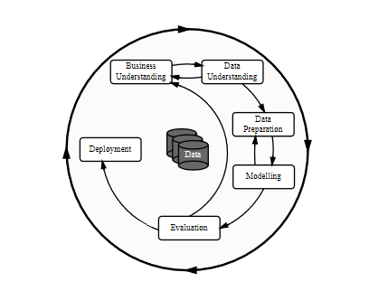
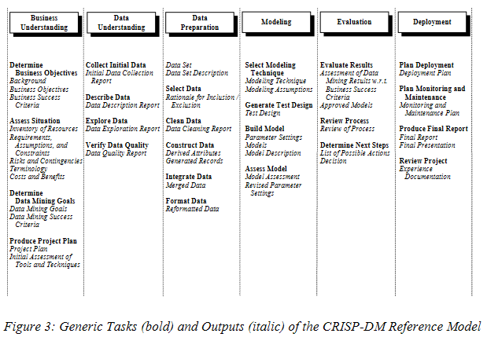
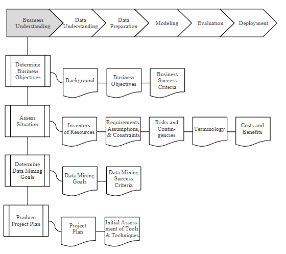
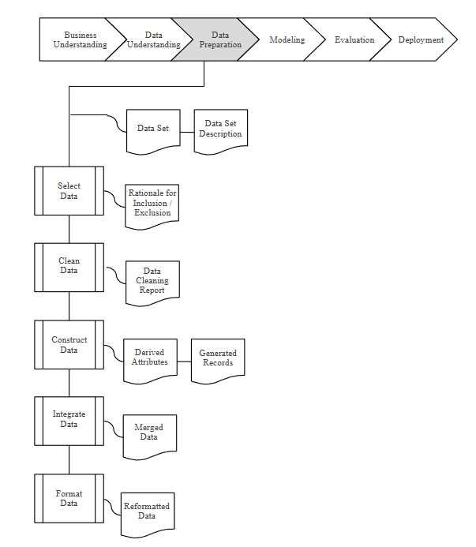
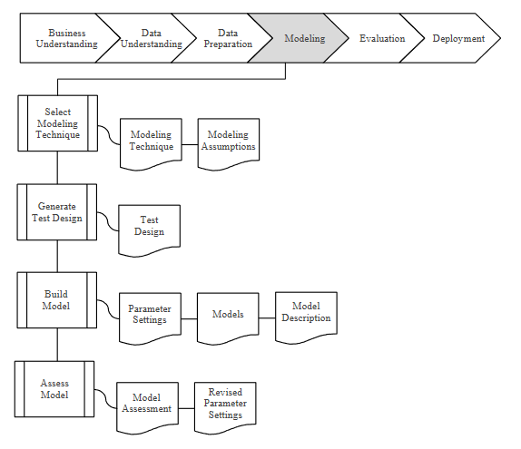
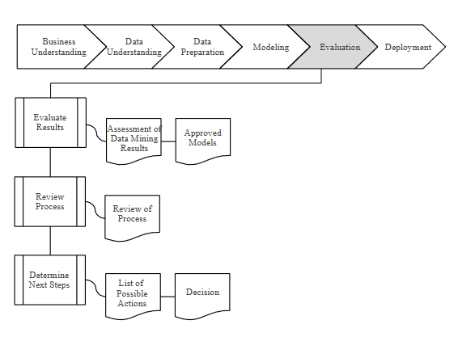
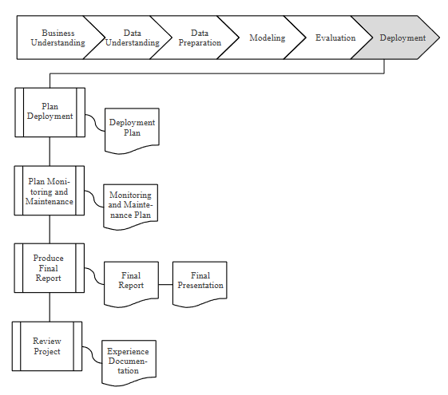

# CRISP-DM - CRISP-DM Paper (1999)

I) Introduction

II) Reference Model

- Business Understanding: This initial phase focuses on understanding the project objectives and requirements
from a business perspective, and then converting this knowledge into a data mining
problem definition, and a preliminary plan designed to achieve the objectives.
- Data Understanding: The data understanding phase starts with an initial data collection and proceeds with
activities in order to get familiar with the data, to identify data quality problems, to
discover first insights into the data, or to detect interesting subsets to form hypotheses
for hidden information.
- Data Preparation: The data preparation phase covers all activities to construct the final dataset (data that
will be fed into the modeling tool(s)) from the initial raw data. Data preparation tasks
are likely to be performed multiple times, and not in any prescribed order. Tasks
include table, record, and attribute selection as well as transformation and cleaning of
data for modeling tools.
- Modeling: In this phase, various modeling techniques are selected and applied, and their
parameters are calibrated to optimal values. Typically, there are several techniques for
the same data mining problem type. Some techniques have specific requirements on
the form of data. Therefore, stepping back to the data preparation phase is often
needed.
- Evaluation: At this stage in the project you have built a model (or models) that appears to have
high quality, from a data analysis perspective. Before proceeding to final deployment
of the model, it is important to more thoroughly evaluate the model, and review the
steps executed to construct the model, to be certain it properly achieves the business
objectives. A key objective is to determine if there is some important business issue
that has not been sufficiently considered. At the end of this phase, a decision on the
use of the data mining results should be reached.
- Deployment Creation of the model is generally not the end of the project. Even if the purpose of
the model is to increase knowledge of the data, the knowledge gained will need to be
organized and presented in a way that the customer can use it. Depending on the
requirements, the deployment phase can be as simple as generating a report or as
complex as implementing a repeatable data mining process. In many cases it will be
the customer, not the data analyst, who will carry out the deployment steps. However,
even if the analyst will not carry out the deployment effort it is important for the
customer to understand up front what actions will need to be carried out in order to
actually make use of the created models

III) User Guide

IV) Outputs

# CRISP-DM - CRISP-DM Step-by-step (2000)

I) Introduction

II) Reference Model

III) User Guide

IV) Outputs
